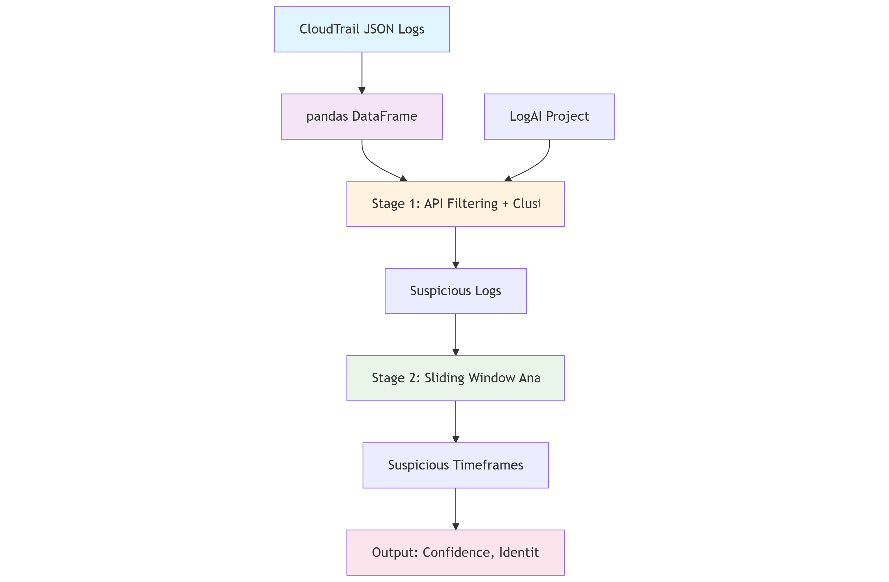
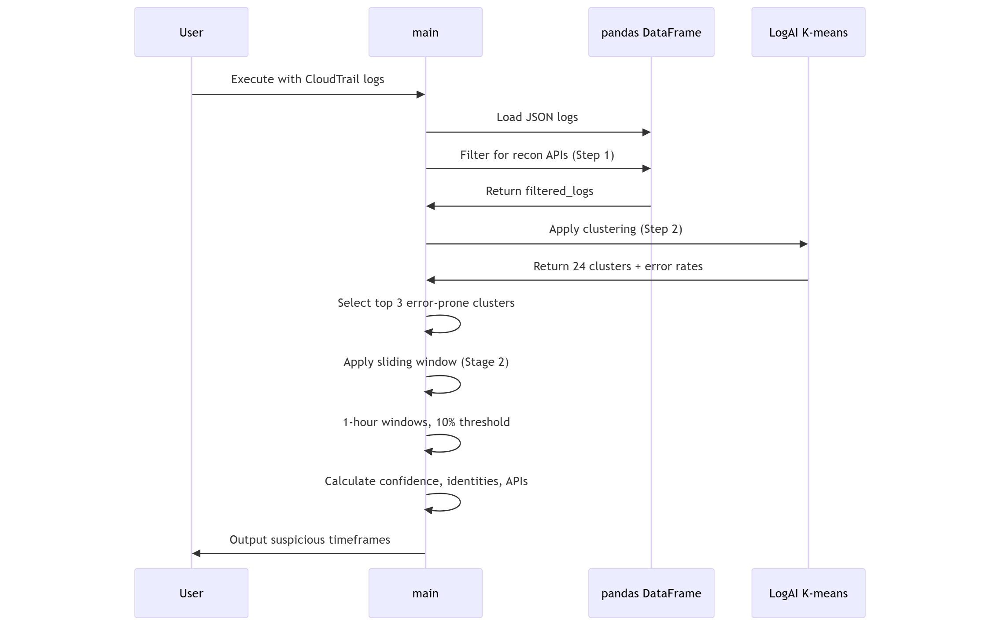

# Design Document: ReconRaptor - AWS CloudTrail Reconnaissance Detection Tool


## Introduction


### Purpose

---
This document outlines the design for a command-line tool that detects reconnaissance activity in AWS CloudTrail logs. The tool will analyze CloudTrail logs to identify suspicious scanning patterns and provide security analysts with actionable intelligence about potential reconnaissance activities.

### Scope

---
The tool will:
- Process CloudTrail logs in JSON format from one or multiple files
- Detect reconnaissance activity using read-only filtering and machine learning clustering
- Output timeframes of suspicious activity with confidence scores, actor identities, and example API calls
- Support filtering by time ranges and specific API types
- Handle large log volumes efficiently using pandas DataFrames

The tool will not:
- Detect activities associated with actions in stages later than reconnaissance, such as data exfiltration, lateral movement, or privilege escalation
- Analyze the intention of attackers or profile attackers beyond basic identity information
- Integrate with external threat intelligence feeds like MITRE or SIEM systems

### Definitions, Acronyms and Abbreviations

---
- **CloudTrail**: AWS service that logs API calls and account activity
- **Reconnaissance**: Information gathering activities that may precede cyber attacks
- **pandas**: Python library for data manipulation and analysis, providing DataFrame structures for efficient log processing
- **DBSCAN**: Clustering algorithm that partitions data into K groups based on similarities. Excludes outliers from groups.
- **LogAI**: Salesforce's open-source log analysis and intelligence platform

### References

---
- [Flaws.cloud CloudTrail Dataset](https://summitroute.com/blog/2020/10/09/public_dataset_of_cloudtrail_logs_from_flaws_cloud/)
- [pandas Documentation](https://pandas.pydata.org/docs/)
- [LogAI Clustering Demo](https://github.com/salesforce/logai/tree/main?tab=readme-ov-file#log-clustering)
<!-- - [AWS Reconnaissance API Reference](https://github.com/shijiew555/ReconRaptor/blob/main/docs/aws_recon_api_reference.md) -->
- [AWS Reconnaissance API Reference](aws_recon_api_reference.md)

## System Overview


The system is designed as a command-line tool that processes CloudTrail logs to detect reconnaissance activity. It employs a two-stage detection approach:

1. **Stage 1**: Gather suspicious logs using either API signature matching and ML clustering
2. **Stage 2**: Analyze temporal patterns to identify concentrated timeframes of suspicious activity

The tool leverages pandas DataFrames for efficient log processing and provides configurable output filtering options. The design prioritizes performance for large log volumes while maintaining accuracy in detection.

### Technology Choice

---
**pandas DataFrames** were selected as the primary query engine after evaluating alternatives including TailPipe + DuckDB. pandas was chosen for its performance (processing large logs within seconds), language consistency (Python-native), and mature ecosystem. TailPipe + DuckDB were rejected due to language inconsistency (Go vs Python) and limited ecosystem maturity compared to pandas.

## System Components


### Decomposition Description

---

This section illustrates the high-level dependencies and data flow between the main components of the ReconRaptor tool.




### User Interactions (CLI Options)

---
When using ReconRaptor, the user needs to pass in the log file(s) and specify CLI options. The output will be printed to terminal or into a file, then the program terminates.

ReconRaptor offers filter options for output, either by time, API type, detection method (ML or rule-based). It also allows different output format, either as file or standard output.
```bash
# Basic usage
reconraptor -f cloudtrail1.json,cloudtrail2.json

# With time filtering
reconraptor -f logs/*.json --start 2025-01-01T00:00:00Z --end 2025-01-02T00:00:00Z

# With API type filtering
reconraptor -f logs/*.json --api ec2,iam,s3

# With detection approach selection
reconraptor -f logs/*.json --approach clustering

# Output formatting
reconraptor -f logs/*.json --output json --verbose
```

**CLI Options:**


- `-f, --files`: Comma-separated list of CloudTrail JSON files (required)
- `--start`: Start time for analysis (ISO 8601 format)
- `--end`: End time for analysis (ISO 8601 format)
- `--api`: Comma-separated list of API types to scan for
- `--approach`: Detection approach: "signature" (default) or "clustering"
- `--output`: Output format: "table" (default), "json", or "csv"
- `--verbose`: Enable detailed logging
- `--help`: Show help information

## Detailed Design


### Algorithm Details

---

The reconnaissance detection workflow consists of 2 stages designed to identify and analyze suspicious activity patterns in CloudTrail logs:

**Stage 1: Suspicious Log Gathering** - This stage employs a two-step approach: first filtering logs with `readOnly` set to true using pandas, then applying DBSCAN clustering to separate suspicious logs from legitimate ones based on error patterns.

**Stage 2: Timeframe Analysis** - This stage analyzes the temporal distribution of suspicious logs to identify the timeframes where reconnaissance activity occurred. It uses a sliding window algorithm to find timeframes with high density of suspicious activity. It calculates the identities, confidence score, example APIs, for each identified timeframe.

**Abandoned Algorithm Ideas:**

- **Supervised Learning with CloudWatch**: Considered using CloudWatch to generate labeled data from flaws.cloud dataset, but rejected due to continuous retraining requirement.
- **K-means**: A clustering method that is not density-based. It is more prone to the impact of outliers than DBSCAN. 

#### Stage 1: Suspicious Log Gathering

---
Stage 1 employs a two-step approach to identify suspicious logs from CloudTrail data:

**Step 1: Read-only Filtering**
First, we filter logs where the `readOnly` field is set to true, since reconnaissance scans perform read-only operations. This is implemented using pandas DataFrame operations for efficient filtering.

```python
# Filter logs containing read-only operations
filtered_logs = df[df['readOnly'] == True]
```

**Step 2: DBSCAN Clustering for Suspicious Log Identification**
The filtered logs are then processed using a DBSCAN clustering model to separate suspicious logs from legitimate ones. The model clusters logs into 24 groups based on similarity, and the top 3 groups with the highest percentage of error codes are selected as suspicious.

**Clustering Implementation Details:**
- **Model Source**: The DBSCAN clustering model is part of the open-source LogAI project, with clustering demo available at: https://github.com/salesforce/logai/tree/main?tab=readme-ov-file#log-clustering
- **Feature Vector**: Each log is represented by a 13-dimensional feature vector containing: `("eventName", "eventSource", "eventCategory", "eventType", "userIdentity", "sessionContext", "recipientAccountId", "sourceIPAddress", "awsRegion", "userAgent", "errorCode", "requestParameters", "responseElements")`
- **Suspicious Log Selection**: Logs in the top 3 clusters with the **highest error percentages** are flagged as suspicious. This approach leverages the insight that legitimate logs (e.g., from Infrastructure as Code workflows) typically don't result in many errors, while reconnaissance activities often generate error codes due to access attempts or invalid parameters.
- **Outlier Handling:** DBSCAN use a density-based clustering method that labels noise rather than forcing every point into a cluster. A point without sufficient neighbors, This prevents one-off events from forming artificial tiny clusters.

**Advantages of This Approach:**
- **Better Accuracy**: The DBSCAN model can correlate logs using more information than just API names, providing more nuanced detection
- **Error-based Filtering**: Uses error codes as a reliable indicator of suspicious activity
- **Comprehensive Feature Analysis**: Considers multiple dimensions including user identity, session context, and request parameters

**Trade-offs:**
- May omit some suspicious logs that don't fall into the top 3 error-prone clusters. 

#### Stage 2: Timeframe Selection and Analysis

---

**Sliding Window Algorithm**

The sliding window algorithm examines the temporal distribution of suspicious logs by moving a 1-hour time window across the log timeline. Timeframes that contain a density of suspicious logs reaching a 10% threshold are flagged as potential reconnaissance periods.

**Algorithm Parameters:**
- **Window Size**: 1 hour
- **Density Threshold**: 10% suspicious logs within the timeframe
- **Window Movement**: Continuous sliding across the timeline

**Design Rationale:**
This approach is based on the observation that reconnaissance scans tend to aggregate temporally, often occurring as sudden bursts of activity. The algorithm focuses on timeframes with concentrated suspicious activity rather than isolated incidents.

**Advantages:**
- **Threat-focused Detection**: Prioritizes timeframes with high concentrations of reconnaissance activity, which pose greater security risks
- **Efficient Processing**: Simple sliding window implementation with clear thresholds
- **Practical Security Value**: Aligns with security analysts' need to identify periods of heightened threat activity

**Trade-offs:**
- Could miss reconnaissance activities that are spread thinly over time
- **Justification**: Timeframes with just a few reconnaissance scans pose significantly lower threat levels and are therefore less critical for immediate security response

**Result Attribute Calculation**


For each identified timeframe, the tool calculates 3 key attributes:

- **Confidence**: The percentage of suspicious logs within the timeframe relative to the total number of logs in that period, providing a measure of how likely reconnaissance activities occured inthe timerame

- **Identities**: A list of tuple (IP, IAM user, user-agent, OS) from suspicious logs in the timeframe.

- **Example APIs**: A list of all reconnaissance API calls found within the suspicious logs of the timeframe.


### Sequence Diagram

---

Execution flow of ReconRaptor:




