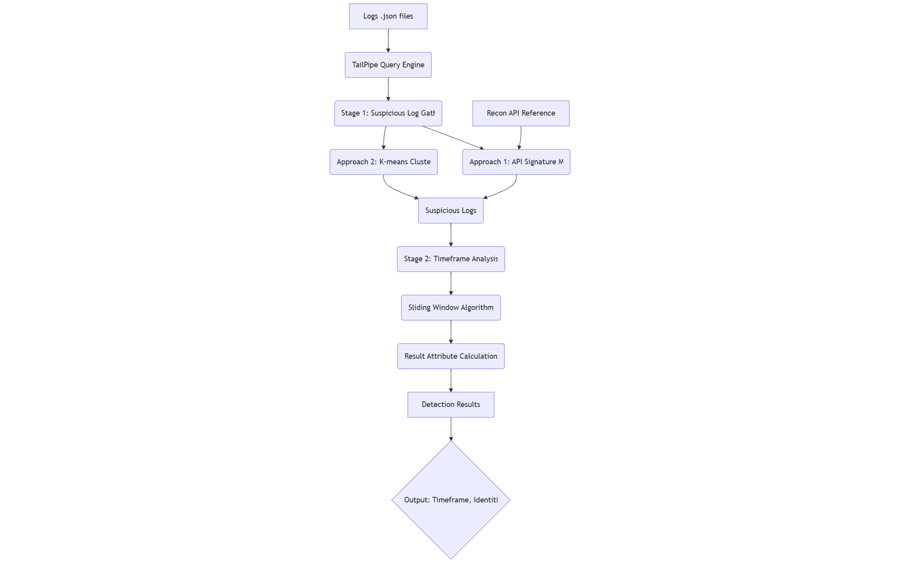

# Design Document: ReconRaptor - AWS CloudTrail Reconnaissance Detection Tool


## Introduction


### Purpose

---
This document outlines the design for a command-line tool that detects reconnaissance activity in AWS CloudTrail logs. The tool will analyze CloudTrail logs to identify suspicious scanning patterns and provide security analysts with actionable intelligence about potential reconnaissance activities.

### Scope

---
The tool will:
- Process CloudTrail logs in JSON format from one or multiple files
- Detect reconnaissance activity using predefined API signatures and optional machine learning clustering
- Output timeframes of suspicious activity with confidence scores, actor identities, and example API calls
- Support filtering by time ranges and specific API types
- Handle large log volumes efficiently using TailPipe

### Definitions, Acronyms and Abbreviations

---
- **CloudTrail**: AWS service that logs API calls and account activity
- **Reconnaissance**: Information gathering activities that may precede cyber attacks
- **TailPipe**: Go-based open source log querying tool that uses DuckDB for processing
- **DuckDB**: In-process analytical database designed for analytical workloads
- **K-means**: Clustering algorithm that partitions data into K groups based on similarities
- **LogAI**: Salesforce's open-source log analysis and intelligence platform

### References

---
- [Flaws.cloud CloudTrail Dataset](https://summitroute.com/blog/2020/10/09/public_dataset_of_cloudtrail_logs_from_flaws_cloud/)
- [TailPipe GitHub Repository](https://github.com/turbot/tailpipe)
- [LogAI Clustering Demo](https://github.com/salesforce/logai/tree/main?tab=readme-ov-file#log-clustering)
<!-- - [AWS Reconnaissance API Reference](https://github.com/shijiew555/ReconRaptor/blob/main/docs/aws_recon_api_reference.md) -->
- [AWS Reconnaissance API Reference](aws_recon_api_reference.md)

## System Overview


The system is designed as a command-line tool that processes CloudTrail logs to detect reconnaissance activity. It employs a two-stage detection approach:

1. **Stage 1**: Gather suspicious logs using either API signature matching or machine learning clustering
2. **Stage 2**: Analyze temporal patterns to identify concentrated timeframes of suspicious activity

The tool leverages TailPipe for efficient log processing and provides configurable output filtering options. The design prioritizes performance for large log volumes while maintaining accuracy in detection.

## System Components


### Decomposition Description

---

This section illustrates the high-level dependencies and data flow between the main components of the ReconRaptor tool.




### User Interactions (CLI Options)

---
When using ReconRaptor, the user needs to pass in the log file(s) and specify CLI options. The output will be printed to terminal or into a file, then the program terminates.

ReconRaptor offers filter options for output, either by time, API type, detection method (ML or rule-based). It also allows different output format, either as file or standard output.
```bash
# Basic usage
reconraptor -f cloudtrail1.json,cloudtrail2.json

# With time filtering
reconraptor -f logs/*.json --start 2025-01-01T00:00:00Z --end 2025-01-02T00:00:00Z

# With API type filtering
reconraptor -f logs/*.json --api ec2,iam,s3

# With detection approach selection
reconraptor -f logs/*.json --approach clustering

# Output formatting
reconraptor -f logs/*.json --output json --verbose
```

**CLI Options:**


- `-f, --files`: Comma-separated list of CloudTrail JSON files (required)
- `--start`: Start time for analysis (ISO 8601 format)
- `--end`: End time for analysis (ISO 8601 format)
- `--api`: Comma-separated list of API types to scan for
- `--approach`: Detection approach: "signature" (default) or "clustering"
- `--output`: Output format: "table" (default), "json", or "csv"
- `--verbose`: Enable detailed logging
- `--help`: Show help information

## Detailed Design


### Algorithm Details

---

The reconnaissance detection workflow consists of 2 stages designed to identify and analyze suspicious activity patterns in CloudTrail logs:

**Stage 1: Suspicious Log Gathering** - This stage filters the input logs to identify entries that match reconnaissance patterns. It employs 2 different approaches to detect suspicious activity, with the primary method being API matching and a ML approach as an enhancement.

**Stage 2: Timeframe Analysis** - This stage analyzes the temporal distribution of suspicious logs to identify the timeframes where reconnaissance activity occurred. It uses a sliding window algorithm to find timeframes with high density of suspicious activity. It calculates the identities, confidence score, example APIs, for each identified timeframe.

#### Stage 1: Suspicious Log Gathering

---
There are 2 different approaches for Stage 1.

*Approach 1: API Signature Matching (Primary Implementation)*


This approach scans logs with a predefined lists of AWS API calls commonly associated with reconnaissance activities. See the curated list in [aws_recon_api_reference.md](https://github.com/shijiew555/ReconRaptor/blob/main/docs/aws_recon_api_reference.md). The tool executes SQL queries through TailPipe to filter CloudTrail logs for specific API names like `DescribeInstances`, `ListBuckets`, `GetUser`, `ListRoles`, and `DescribeSecurityGroups`. 

*Approach 2: K-means Clustering (Future Enhancement)*


This approach leverages K-means clustering model introduced by logAI to group logs by similarity across multiple dimensions beyond just API names. The algorithm partitions logs into clusters and then scores each cluster based on the percentage of reconnaissance APIs it contains. The top 3 clusters with the highest reconnaissance percentages are selected for stage 2.

#### Stage 2: Timeframe Selection and Analysis

---

**Sliding Window Algorithm**


The sliding window algorithm examines the temporal distribution of suspicious logs by moving a configurable time window across the log timeline. Timeframes that meet a minimum density threshold are identified as potential reconnaissance periods. The algorithm then merges overlapping timeframes to create final detection results.

**Result Attribute Calculation**


For each identified timeframe, the tool calculates 3 key attributes:

- **Confidence**: The percentage of suspicious logs within the timeframe relative to the total number of logs in that period, providing a measure of how likely reconnaissance activities occured inthe timerame

- **Identities**: A list of tuple (IP, IAM user, user-agent, OS) from suspicious logs in the timeframe.

- **Example APIs**: A list of all reconnaissance API calls found within the suspicious logs of the timeframe.

### Sequence Diagram

---

Execution flow of ReconRaptor:


